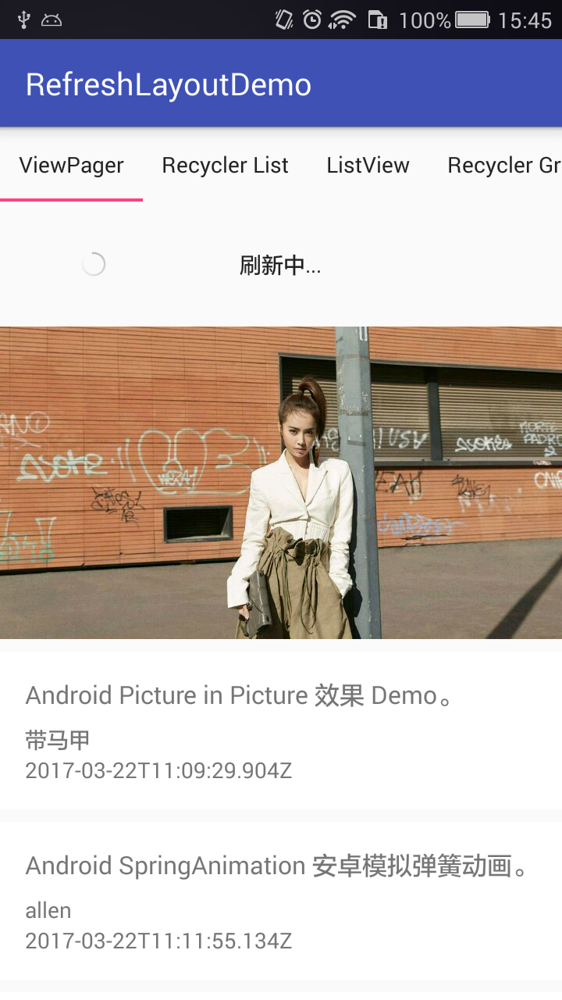
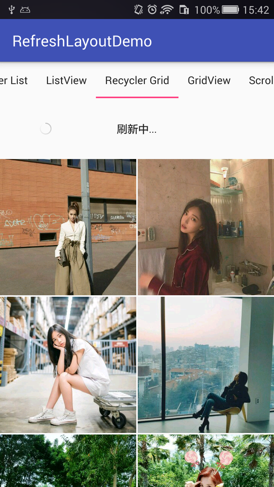

# RefreshLayoutDemo
这个一个通用的下拉刷新上拉加载控件，支持各种常见View。

#### 实现参考[SwipeToLoadLayout](https://github.com/Aspsine/SwipeToLoadLayout)和[android-Ultra-Pull-To-Refresh](https://github.com/liaohuqiu/android-Ultra-Pull-To-Refresh)

#### 主要类说明：
1. RefreshLayout 下拉刷新/上拉加载控件
2. RefreshHeaderView 刷新头（可自定义样式）
3. LoadMoreFooterView 加载尾（可自定义样式）

#### Demo中包含以下运用场景：
1. ListView包含ViewPager头部
2. RecyclerView列表
3. ListView
4. RecyclerView表格
5. GridView
6. ScrollView
7. WebView
8. RelativeLayout
9. TextView

##### demo中使用干货（ http://gank.io ）的API， HTTP请求使用okhttp，JSON解析使用fastjson，感谢！

